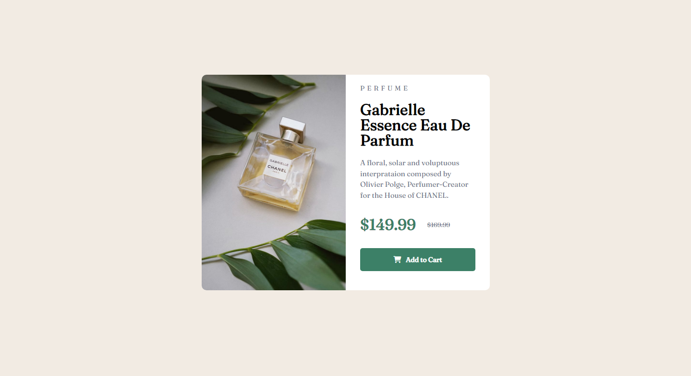
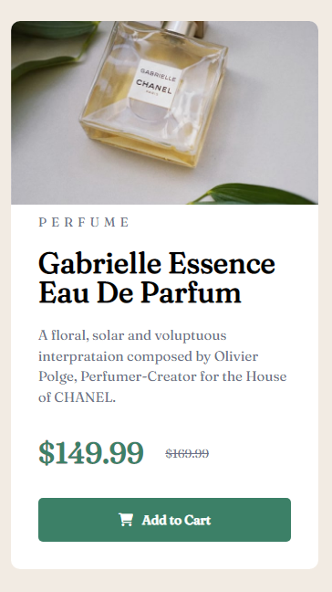

# Frontend Mentor - Product preview card component solution

This is my solution to the [Product preview card component challenge on Frontend Mentor](https://www.frontendmentor.io/challenges/product-preview-card-component-GO7UmttRfa).

## Table of contents

- [Overview](#overview)
  - [The challenge](#the-challenge)
  - [Screenshot](#screenshot)
  - [Links](#links)
- [My process](#my-process)
  - [Built with](#built-with)
  - [What I learned](#what-i-learned)
  - [Continued development](#continued-development)
  - [Useful resources](#useful-resources)
- [Author](#author)

## Overview

### The challenge

Users should be able to:

- View the optimal layout depending on their device's screen size
- See hover and focus states for interactive elements

### Screenshot




### Links

- Solution URL: [Add solution URL here](https://your-solution-url.com)
- Live Site URL: [Add live site URL here](https://your-live-site-url.com)

## My process

### Built with

- Semantic HTML5 markup
- CSS3 styling
- Flexbox
- fontawesome for the cart icon
- Media Query for mobile screen sizes

### What I learned

Got a little better in media queries. Proud of this css code for screen sizes smaller than 600px.

```css
.main-container {
  flex-direction: column;
  max-width: 90%;
  height: 90vh;
  margin: 30px auto;
}
```

### Continued development

I want to perfect my responsive design - media queries, it's my weak point. I also want to continue learning CSS Flexbox and Grid.

### Useful resources

- [Traversy Media](https://www.youtube.com/watch?v=UB1O30fR-EE&list=PLillGF-RfqbZTASqIqdvm1R5mLrQq79CU&ab_channel=TraversyMedia) - I want to give a huge shout out to Brad Traversy from Traversy Media. His YouTube channel is full of amazing web development courses and CodeAlong projects. I myself only check out the stuff that is FrontEnd-related (of course :D). Here's the link for HTML & CSS playlist which is my number one go-to place for learning this stuff, and I already learned a lot.

## Author

- Frontend Mentor - [@MladenAntic](https://www.frontendmentor.io/profile/MladenAntic)
